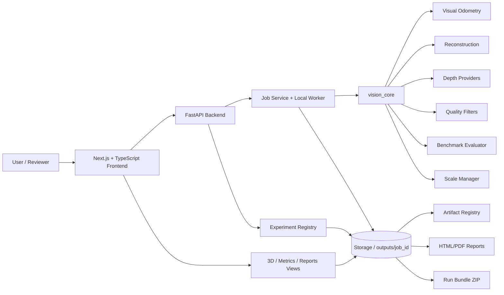
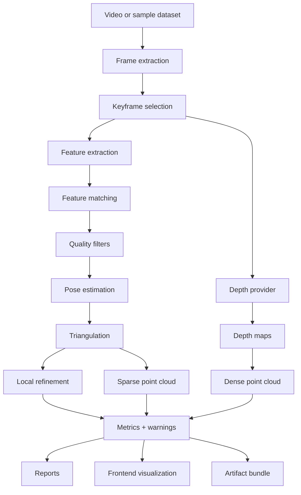
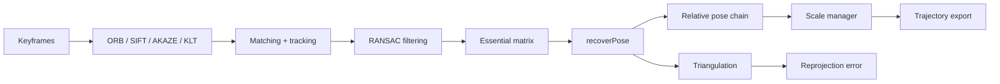
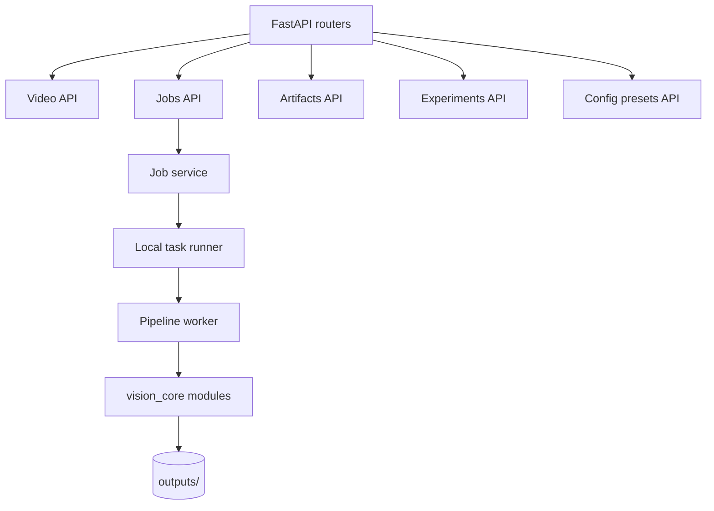
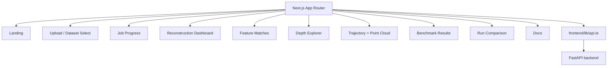
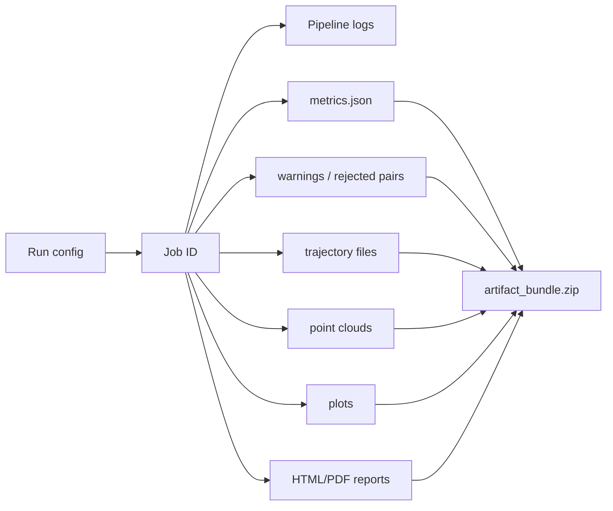
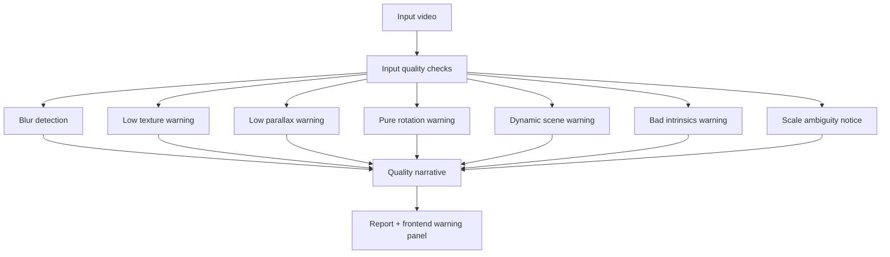

# SceneMotion-3D

<p align="center">
  <strong>Production-style core computer vision platform for monocular visual odometry, 3D reconstruction, trajectory evaluation, depth-assisted point clouds, quality diagnostics, and benchmark reporting.</strong>
</p>

<p align="center">
  
  
  
  
  
  
  
  
  
</p>

## One-line summary

**SceneMotion-3D** is a production-style core computer vision platform for monocular visual odometry, trajectory evaluation, sparse/dense reconstruction, depth-assisted point clouds, quality diagnostics, and benchmark reporting.

It is designed to demonstrate real 3D vision engineering: feature matching, essential matrix estimation, pose recovery, triangulation, reprojection error, local bundle adjustment, ATE/RPE evaluation, scale handling, loop-candidate detection, artifact tracking, and frontend visualization.

> **Honest scale disclaimer:** SceneMotion-3D estimates **relative monocular trajectory by default**. Absolute metric scale requires additional information such as known camera intrinsics, known object size, known camera height, stereo baseline, depth sensor, IMU, or ground-truth alignment for evaluation. Fallback pseudo-depth is provided for offline demonstration only and must not be interpreted as metric depth.

---

## Why this project exists

Most portfolio computer vision projects stop at object detection, dashboards, or a single pretrained model. SceneMotion-3D focuses on the geometry-heavy side of computer vision used in robotics perception, SLAM, AR/VR tracking, autonomous navigation, and 3D reconstruction.

The project is built so a reviewer can inspect not only the final point cloud, but also the intermediate evidence: keyframes, feature tracks, inlier ratios, rejected pairs, scale mode, trajectory files, ATE/RPE benchmark metrics, quality warnings, and report artifacts.

## Why this is core computer vision, not a wrapper

SceneMotion-3D implements a real classical geometry pipeline around OpenCV primitives and project-owned modules. The system does not depend on a YOLO detector, a chatbot, a RAG stack, or a single pretrained model wrapper. The core logic includes:

- frame extraction and keyframe selection
- ORB / AKAZE / optional SIFT feature pipelines
- descriptor matching and KLT tracking presets
- robust RANSAC filtering
- essential matrix estimation and `recoverPose`
- relative pose chaining and monocular scale handling
- triangulation and reprojection error calculation
- sparse point cloud export
- fallback or provider-based depth generation
- dense depth-to-cloud projection
- sliding-window local refinement using `scipy.least_squares`
- loop-candidate detection and geometric verification
- ATE/RPE benchmark evaluation with Sim(3) alignment for evaluation only

---

## Feature highlights

| Category | Implemented capability |
|---|---|
| Video ingestion | upload/sample video workflow, metadata extraction, safe frame extraction |
| Keyframes | fixed interval, blur/sharpness filtering, duplicate rejection, max-keyframe config |
| Features | ORB default, AKAZE optional, SIFT if OpenCV build supports it, KLT preset |
| Matching | BF/FLANN-style matching, ratio test, cross-check option, RANSAC metrics |
| Visual odometry | essential matrix, pose recovery, relative trajectory, degenerate motion warnings |
| Reconstruction | triangulation, sparse PLY/JSON, reprojection error, dense point cloud from depth |
| Scale | relative, known-distance, camera-height, RGB-D/depth-assisted, evaluation-only Sim(3) |
| Evaluation | trajectory IO, timestamp alignment, ATE, RPE, plots, benchmark HTML report |
| Robustness | blur, low texture, low parallax, pure rotation, dynamic-scene warnings |
| SLAM-style design | lightweight loop-candidate retrieval and verification |
| Engineering | FastAPI backend, Next.js frontend, Docker Compose, Makefile, tests, CI workflow |
| Artifacts | metrics, warnings, plots, point clouds, reports, run bundle ZIP |

---

## Demo screenshots

> These screenshots are **generated UI preview assets** from the repository screenshot script. They are included to document intended UI states and output artifacts. Live browser screenshots can be regenerated after running the frontend.

| View | Preview |
|---|---|
| Landing page | `docs/screenshots/landing_page.png` |
| Upload / dataset select | `docs/screenshots/upload_page.png` |
| Processing page | `docs/screenshots/processing_page.png` |
| Reconstruction dashboard | `docs/screenshots/reconstruction_dashboard.png` |
| Feature matches | `docs/screenshots/feature_matches.png` |
| Depth explorer | `docs/screenshots/depth_explorer.png` |
| Point cloud viewer | `docs/screenshots/pointcloud_viewer.png` |
| Benchmark report | `docs/screenshots/benchmark_report.png` |
| Run comparison | `docs/screenshots/run_comparison.png` |
| PDF report preview | `docs/screenshots/pdf_report_preview.png` |
| Artifact bundle | `docs/screenshots/artifact_bundle.png` |

Generate them with:

```bash
make screenshots
```

---

## System architecture



## End-to-end workflow



## Visual odometry internals



## Benchmark evaluation workflow

```mermaid
flowchart TD
    E[Estimated trajectory] --> T[Timestamp alignment]
    G[Ground-truth trajectory] --> T
    T --> S[Sim(3) alignment - evaluation only]
    S --> A[ATE metrics]
    S --> R[RPE metrics]
    A --> P[Trajectory/error plots]
    R --> P
    P --> B[Benchmark report]
```

## Backend architecture



## Frontend architecture



## Artifact lifecycle



## Limitation handling workflow



---

## Implemented vs experimental vs future work

| Feature | Status | Reason / honesty note |
|---|---|---|
| Classical monocular VO | Implemented | Relative-scale trajectory only |
| ORB + BF feature matching | Implemented | Offline-safe default |
| AKAZE / optional SIFT | Implemented/configurable | Availability depends on OpenCV build |
| KLT tracking preset | Implemented | Useful for tracking experiments |
| Essential matrix + recoverPose | Implemented | Rejects weak pairs when possible |
| Triangulation + reprojection error | Implemented | Quality depends on parallax and intrinsics |
| Sparse point cloud PLY/JSON | Implemented | Relative coordinates by default |
| Dense cloud from depth | Implemented | Uses provider/fallback depth |
| Fallback pseudo-depth | Implemented | Demo-only, not metric |
| External / RGB-D depth provider hooks | Implemented | Requires local depth inputs |
| ATE/RPE benchmark | Implemented | Requires ground truth |
| Sim(3) alignment | Implemented | Evaluation only, not runtime scale recovery |
| Sliding-window local BA | Implemented educational module | Not a COLMAP/g2o/Ceres replacement |
| Loop-candidate detection | Implemented lightweight module | Not full pose-graph optimization |
| TUM/KITTI/EuRoC adapters | Implemented local validators | Large datasets are not bundled |
| Gaussian Splatting training | Future work/export hook only | No training claim |
| Full global BA | Future work | Would require mature SfM-scale optimizer |
| Dense SLAM | Experimental/future | Not claimed as implemented |
| Real-time SLAM | Future work | Current pipeline is batch/offline |
| Metric monocular scale without reference | Not possible | One camera cannot infer absolute scale alone |
| IMU fusion | Future work | Not implemented |
| Stereo VO | Future work | Not implemented |
| Production cloud deployment | Future work | Architecture is production-style, not production-certified |

---

## Quickstart

```bash
unzip SceneMotion-3D-Final-Professional.zip
cd SceneMotion-3D

python -m venv .venv
source .venv/bin/activate  # Windows: .venv\Scripts\activate
pip install -r backend/requirements.txt

make test
make demo
make benchmark-demo
make bundle-demo
make screenshots
```

## Docker setup

```bash
make docker-up
```

Docker Compose starts the FastAPI backend, Next.js frontend, and Redis service. Redis is included for future distributed worker mode; the offline demo works with the local worker mode.

## Local development setup

Backend:

```bash
make backend-dev
```

Frontend:

```bash
make frontend-dev
# or
cd frontend && npm install && npm run dev
```

## Demo commands

```bash
make demo                 # synthetic video pipeline
make demo-custom VIDEO=path/to/video.mp4
make bundle-demo          # create artifact_bundle.zip
make screenshots          # generate UI preview screenshots
```

## Benchmark commands

```bash
make benchmark-demo
```

Benchmark demo output:

```text
outputs/benchmark_demo/
  estimated_trajectory.txt
  ground_truth_trajectory.txt
  ate_metrics.json
  rpe_metrics.json
  trajectory_plot.png
  error_plot.png
  benchmark_report.html
```

## Testing commands

```bash
python -m compileall backend vision_core workers scripts
make test
make validate-final
cd frontend && npm install && npm run typecheck && npm run build
```

---

## Output artifacts

A demo run writes to `outputs/demo_job_synthetic/`:

| Artifact | Purpose |
|---|---|
| `frames/` | extracted frames |
| `keyframes/` | selected keyframes and metadata |
| `features/` | keypoint data and visualizations |
| `matches/` | match visualizations and pair metrics |
| `depth/` | depth PNG/NPY outputs and provider metadata |
| `pointclouds/sparse_cloud.ply` | sparse triangulated cloud |
| `pointclouds/dense_cloud.ply` | dense depth-projected cloud |
| `trajectory.json` | relative trajectory |
| `metrics.json` | numeric run metrics |
| `quality/rejected_pairs.json` | rejected pair reason codes |
| `report.html` | human-readable run report |
| `report.pdf` | PDF report |
| `artifact_bundle.zip` | portable run evidence bundle |

---

## Demo metrics from included synthetic run

| Metric | Value |
|---|---:|
| Extracted frames | 16 |
| Selected keyframes | 8 |
| Avg keypoints/keyframe | 1638.125 |
| Avg matches/pair | 532.5714285714286 |
| Avg inlier ratio | 0.6680122740205736 |
| Valid pose pairs | 7 |
| Sparse 3D points | 3371 |
| Depth maps | 4 |
| Dense cloud points | 4240 |

## Benchmark metrics from included synthetic benchmark

| Metric | Value |
|---|---:|
| Aligned trajectory pairs | 40 |
| ATE RMSE | 0.056771800117580366 |
| ATE mean | 0.05243662060155463 |
| ATE max | 0.09821669598766167 |
| RPE RMSE | 0.08024793955827417 |
| RPE mean | 0.07435325931646987 |
| RPE max | 0.13645125248401713 |

These are generated by repository scripts, not hand-written benchmark claims. The synthetic benchmark is small and intended for validation/CI, not state-of-the-art comparison.

---

## Project folder structure

```text
SceneMotion-3D/
  backend/             FastAPI API, job services, storage, security helpers
  frontend/            Next.js + TypeScript dashboard and visualization pages
  vision_core/         Core VO, reconstruction, scale, quality, evaluation modules
  workers/             Local pipeline runner
  configs/             Pipeline presets and experiment configs
  docs/                Architecture, theory, benchmarking, limitations, interview docs
  demo_media/          2-minute demo script, storyboard, release/social assets
  scripts/             Synthetic data, demo, screenshots, final validation helpers
  sample_data/         Small sample video and intrinsics JSON
  outputs/             Included demo outputs, reports, plots, bundles, validation JSON
  tests/               Pytest suite
  .github/             CI workflow, issue templates, PR template
```

---

## API overview

| Endpoint | Purpose |
|---|---|
| `GET /api/health` | service and dependency health |
| `POST /api/videos/upload` | upload MP4 video with validation |
| `GET /api/videos/samples` | list bundled sample videos |
| `POST /api/jobs/start` | start a reconstruction job |
| `GET /api/jobs/{job_id}` | get job status |
| `POST /api/jobs/{job_id}/cancel` | request cancellation |
| `DELETE /api/jobs/{job_id}` | remove in-memory job record |
| `GET /api/jobs/{job_id}/metrics` | fetch metrics |
| `GET /api/jobs/{job_id}/artifacts` | list artifacts |
| `GET /api/jobs/{job_id}/frames` | list extracted frames |
| `GET /api/jobs/{job_id}/trajectory` | fetch trajectory JSON |
| `GET /api/jobs/{job_id}/pointcloud` | download sparse/dense PLY |
| `GET /api/jobs/{job_id}/report` | download HTML/PDF report |
| `GET /api/jobs/{job_id}/bundle` | download artifact bundle ZIP |
| `WS /api/jobs/{job_id}/stream` | progress stream |
| `GET /api/experiments` | list tracked runs |
| `POST /api/experiments/compare` | compare runs |
| `GET /api/config/presets` | list pipeline presets |

See `docs/api_reference.md` for examples and response shapes.

## Frontend pages overview

| Page | Purpose |
|---|---|
| Landing | project explanation and quick navigation |
| Upload / Dataset Select | upload a video or choose a sample |
| Job Progress | WebSocket/polling progress UI |
| Reconstruction Dashboard | metrics, quality score, artifacts |
| Feature Matches | match visualizations and inlier ratios |
| Trajectory + Point Cloud Viewer | 3D-oriented viewer controls and fallback preview |
| Depth Explorer | depth maps, provider labels, confidence notes |
| Benchmark Results | ATE/RPE plots and metrics |
| Run Comparison | compare two local experiment runs |
| Reports / Artifacts | download report and bundle evidence |
| Documentation | limitations, methodology, and workflow notes |

---

## Testing with your own video

Use videos with slow camera translation, visible texture, stable exposure, and minimal dynamic objects.

```bash
make demo-custom VIDEO=path/to/video.mp4
```

Good examples:

- walking slowly around a textured room
- corridor video with visible features and forward translation
- tabletop scene with posters, books, boxes, or textured objects

Bad examples:

- spinning the camera in place with little translation
- blank wall or glossy floor
- fast shaky motion
- dynamic crowd, moving cars, or motion-blurred phone footage
- rolling-shutter-heavy video with rapid panning

Provide calibration/intrinsics when available. Provide known distance, camera height, RGB-D, stereo, IMU, or ground-truth alignment if metric scale is required.

---

## Failure cases and limitation handling

| Limitation | Why it happens | How SceneMotion-3D handles it | Best user fix |
|---|---|---|---|
| Monocular scale ambiguity | One camera cannot infer absolute distance from images alone | relative mode, known-distance mode, camera-height mode, RGB-D/depth-assisted mode, evaluation-only ground-truth alignment | provide scale reference, stereo/RGB-D, IMU, or known object size |
| Low texture | Few repeatable features | keypoint counts, low-texture warnings | record textured surfaces |
| Motion blur | Features smear across frames | blur detection and rejected-pair reasons | slower camera motion, better lighting |
| Pure rotation | Essential matrix has weak translation/parallax | pure-rotation and low-parallax warnings | move camera laterally/forward, not only rotate |
| Dynamic objects | Moving objects break static-scene geometry | optical-flow/dynamic-scene warning | avoid crowds/cars, mask dynamic regions |
| Insufficient parallax | Triangulation becomes unstable | parallax filter and warning narrative | include real translation between frames |
| Repeated patterns | Ambiguous matches | RANSAC inlier checks and match visualization | use varied texture, better viewpoints |
| Bad intrinsics | Projection and triangulation degrade | approximate-intrinsics warning, calibration JSON support | provide camera calibration |
| Rolling shutter | Fast panning distorts geometry | documented warning and failure narrative | slower motion, global-shutter camera if possible |
| Lighting changes | Feature descriptors become unstable | match/inlier metrics expose degradation | stable exposure/lighting |
| Depth fallback not metric | Pseudo-depth is only a visual offline fallback | provider metadata labels fallback depth | use real depth provider or RGB-D input |
| Local BA not full COLMAP | Small educational optimizer only | docs and report disclaimers | use COLMAP/OpenMVG/g2o/Ceres for mature SfM |

---

## Scale ambiguity explanation

A monocular camera observes image coordinates, not absolute depth. If every translation and 3D point is multiplied by the same factor, the reprojection can still look consistent. This is why monocular VO can estimate the **shape and relative motion** up to scale, but cannot know meters without external information.

SceneMotion-3D keeps this visible in the README, reports, scale manager, benchmark docs, and frontend warning card.

---

## Engineering decisions

- **Classical VO first:** demonstrates geometry and robotics perception fundamentals rather than hiding behind a pretrained model.
- **Offline-safe demo:** no huge model weights or external datasets are required for validation.
- **Provider interfaces:** real depth models and dataset adapters can be added without breaking the default demo.
- **Artifact-first design:** every run leaves inspectable evidence: metrics, plots, point clouds, reports, warnings, and bundle ZIP.
- **Honest evaluation:** Sim(3) alignment is used only for benchmark evaluation against ground truth.
- **Production-style architecture:** FastAPI/Next.js/Docker/CI structure is used, but the repo does not claim production SLAM accuracy.

---

## Validation evidence

See `VALIDATION.md` and `outputs/final_validation/validation_summary.json`.

| Validation | Included result |
|---|---|
| Python compile | recorded in final validation JSON |
| Pytest suite | 17 tests expected/passed in this release |
| Demo run | `outputs/demo_job_synthetic/` |
| Benchmark demo | `outputs/benchmark_demo/` |
| Bundle demo | `outputs/demo_job_synthetic/artifact_bundle.zip` |
| Frontend typecheck/build | recorded in `VALIDATION.md` after local validation |
| PDF report | `outputs/demo_job_synthetic/report.pdf` |
| UI previews | `docs/screenshots/*.png` |

---

## Portfolio case study

**Problem:** Build a transparent visual odometry and 3D reconstruction platform that exposes not only outputs, but also failure reasons, uncertainty, scale limitations, and benchmark evidence.

**Why common CV demos are weak:** many demos only show a final object box, model output, or dashboard. They do not expose geometry, diagnostics, reproducibility, or failure conditions.

**What SceneMotion-3D proves:** core perception engineering, backend architecture, frontend visualization, reproducible experiment handling, benchmark methodology, and honest communication of limitations.

**Engineering highlights:** feature matching, robust frame-pair filtering, relative pose estimation, triangulation, reprojection reasoning, sliding-window refinement, trajectory evaluation, scale manager, depth provider abstraction, point cloud generation, run comparison, artifact registry, and professional reporting.

---

## Recommended 2-minute demo video

Use `demo_media/demo_script.md` and `demo_media/demo_storyboard.md`.

Talking points:

- **0:00** problem: most CV demos hide geometry and failure modes
- **0:15** select sample/upload video
- **0:30** show pipeline stages: frames, keyframes, features, matches
- **0:50** show visual odometry: trajectory, relative scale warning, triangulation
- **1:10** show point clouds and depth provider label
- **1:25** show benchmark: ATE/RPE with Sim(3) evaluation-only alignment
- **1:40** show report and artifact bundle
- **1:55** close with limitations and next improvements

---

## What to show recruiters

Open these first:

1. README architecture diagrams
2. `docs/screenshots/`
3. `outputs/demo_job_synthetic/report.pdf`
4. `outputs/benchmark_demo/benchmark_report.html`
5. `docs/portfolio_case_study.md`
6. `docs/interview_guide.md`
7. `tests/`
8. `vision_core/evaluation/`
9. `vision_core/reconstruction/`
10. `vision_core/scale/`

---

## Roadmap

| Priority | Improvement |
|---|---|
| High | Live browser screenshot capture with Playwright when available |
| High | COLMAP export/import compatibility and comparison workflow |
| High | Real Depth Anything / MiDaS provider setup behind explicit config |
| Medium | Pose-graph optimization after loop candidate verification |
| Medium | Camera-frustum rendering in the Three.js viewer |
| Medium | Stereo VO mode with known baseline |
| Medium | IMU preintegration research branch |
| Low | Cloud deployment recipe with object storage and async workers |

---

## License

MIT License. See `LICENSE`.

## Final honesty statement

SceneMotion-3D is a portfolio-grade, production-style engineering project. It is not a claim of state-of-the-art SLAM accuracy, not a production robot navigation stack, and not a metric-scale monocular reconstruction system without references. Its purpose is to demonstrate deep, inspectable computer vision engineering with reproducible demos and visible limitations.
