# SceneMotion-3D

<p align="center">
  <strong>Production-style monocular visual odometry and 3D reconstruction platform with real pipeline artifacts, honest scale handling, and documentation-grade reporting.</strong>
</p>

<p align="center">
  <a href="#screenshots"></a>
  
  
  
  
  
</p>

## About

**SceneMotion-3D** is a geometry-first computer vision project built around the parts of 3D vision that reviewers actually want to inspect:

- feature extraction, matching, and RANSAC filtering
- essential matrix estimation and monocular pose recovery
- sparse triangulation and dense depth-assisted cloud export
- trajectory artifacts, warnings, quality diagnostics, and reports
- a FastAPI + Next.js interface for browsing real run outputs

This repository ships with a completed demo run under `outputs/demo_job_synthetic`, so the docs, screenshots, and artifact pages can all point to **real data** instead of placeholder values.

> **Scale disclaimer:** SceneMotion-3D estimates **relative monocular motion by default**. Metric scale requires an external source such as calibration, known distance, stereo, RGB-D, IMU, or evaluation alignment.

## What Makes This Repo Strong

- It is not a thin wrapper around a detector model; the core work is classical multi-view geometry.
- The repo preserves intermediate evidence: matches, keyframes, metrics, warnings, trajectory JSON, point clouds, and reports.
- The screenshots in this README are generated from the shipped demo artifacts, not fake UI cards.
- The landing page now includes a proper About section with a relevant blue CTA that points to the completed demo reconstruction.

## Demo Snapshot

The bundled `demo_job_synthetic` run currently includes:

- `16` extracted frames
- `8` selected keyframes
- `3,371` sparse 3D points
- `4,240` dense cloud points
- `7` valid pose pairs
- `0.668` average inlier ratio
- `4` verified loop candidates

## Screenshots

These images are generated from the **real** demo metrics, matches, depth maps, and reconstruction outputs using `python scripts/generate_screenshots.py`.

| Landing | Upload |
|---|---|
| 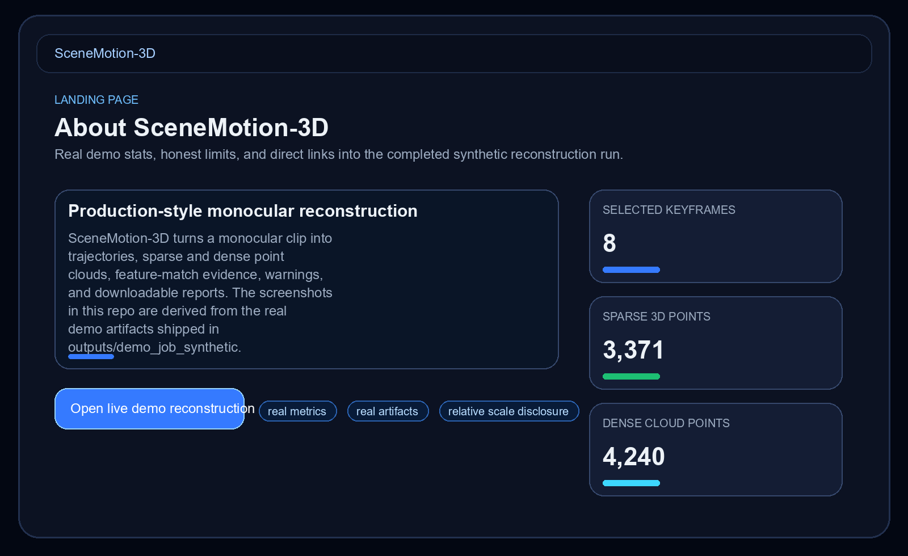 | 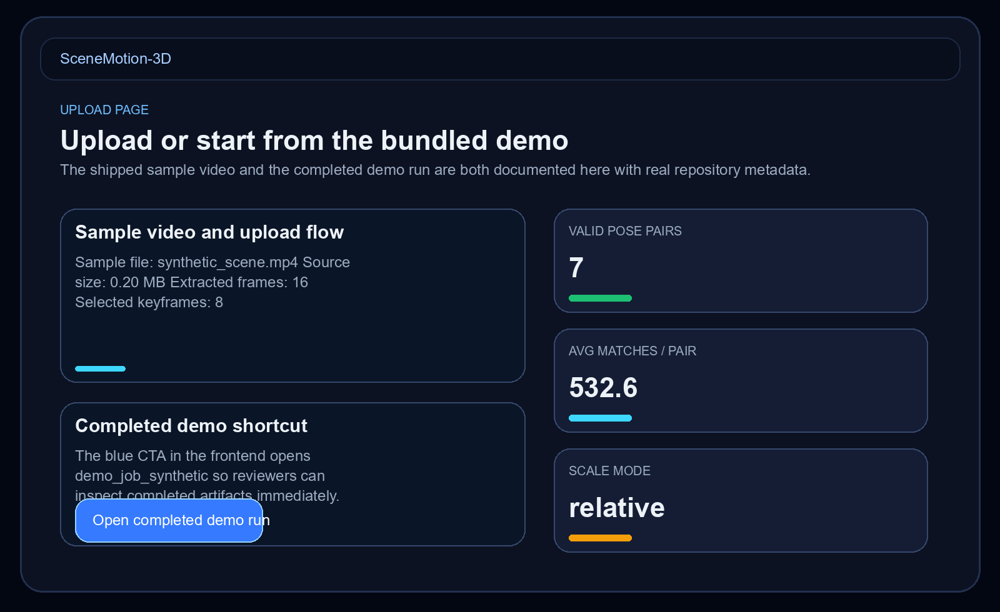 |

| Reconstruction Dashboard | Feature Matches |
|---|---|
| 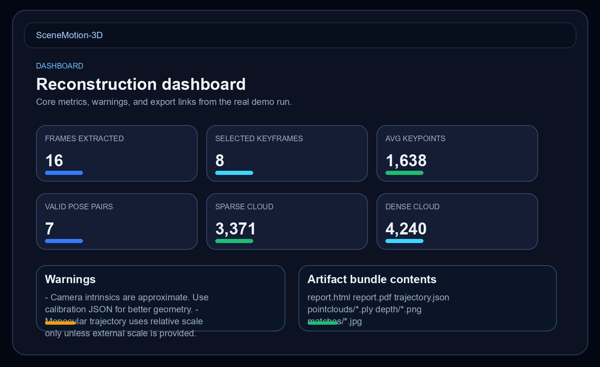 | 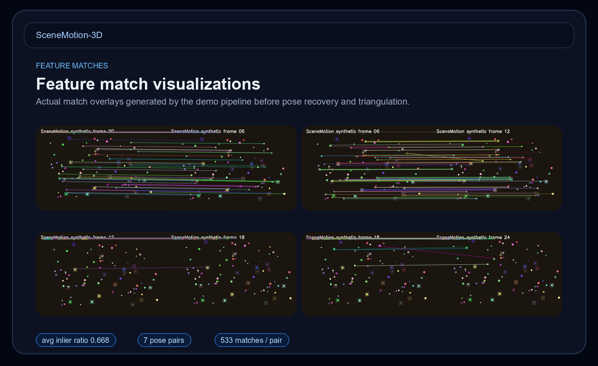 |

| Depth Explorer | Point Cloud Viewer |
|---|---|
| 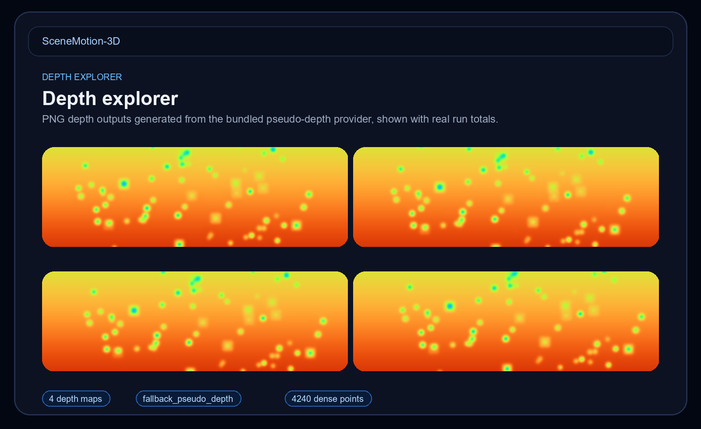 | 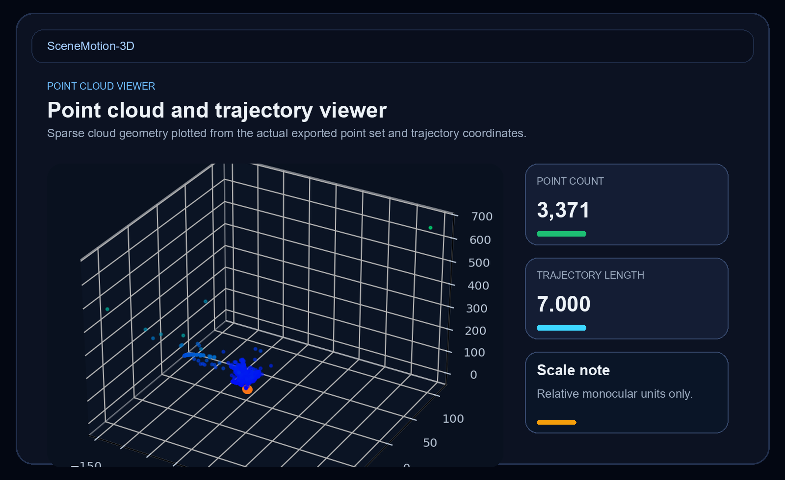 |

| Benchmark Report | Processing View |
|---|---|
| 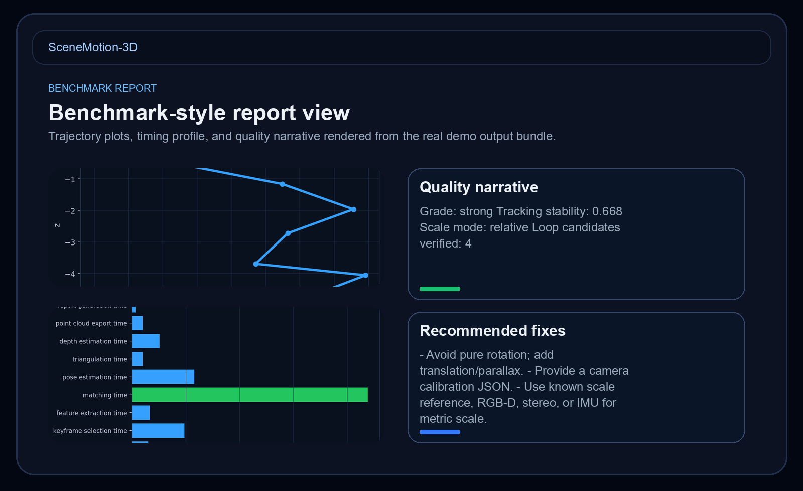 | 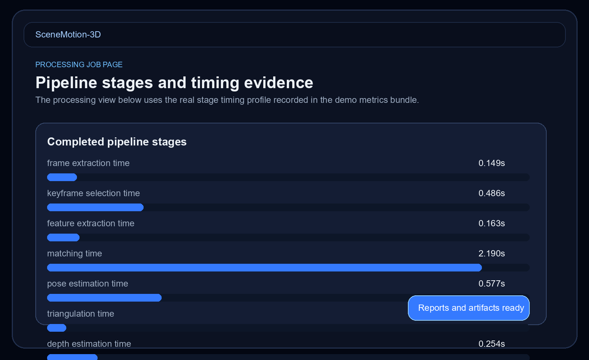 |

## Architecture

### System Architecture

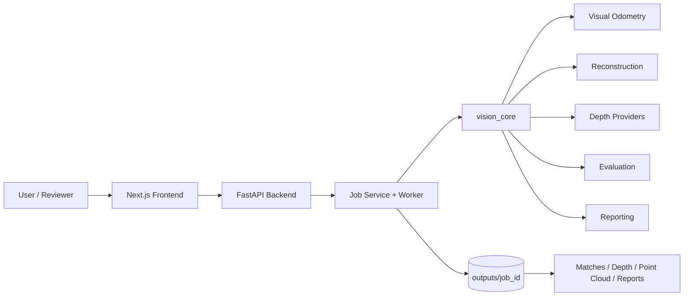

### Pipeline Flow

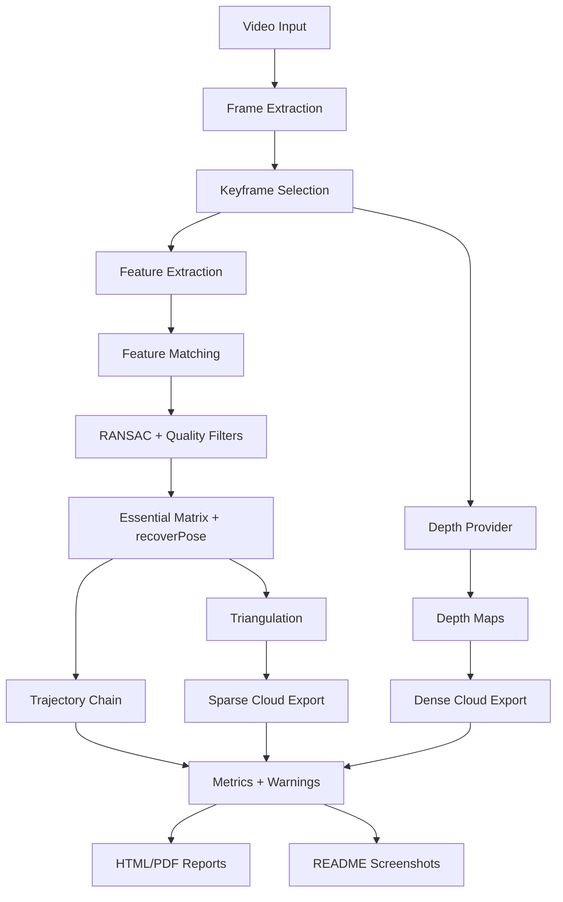

### Artifact Flow

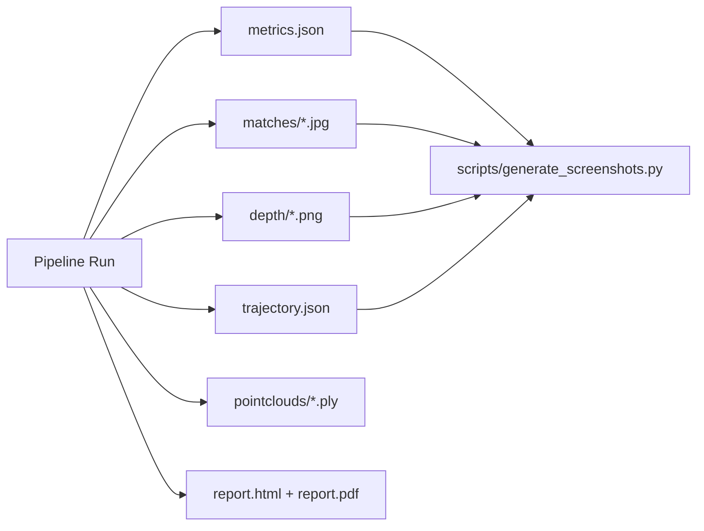

## Folder Structure

```text
SceneMotion-3D/
|-- backend/
|   |-- app/
|   |   |-- api/              FastAPI routers for jobs, videos, artifacts, experiments
|   |   |-- core/             settings and path safety helpers
|   |   |-- schemas/          request/response models
|   |   `-- services/         job store, storage, demo run hydration
|   `-- requirements.txt
|-- frontend/
|   |-- app/                  Next.js App Router pages
|   |-- components/           dashboard, gallery, artifact, and viewer components
|   |-- lib/                  API helpers and demo constants
|   `-- package.json
|-- vision_core/
|   |-- camera/               intrinsics and calibration helpers
|   |-- features/             extractors, matchers, visualization
|   |-- keyframes/            keyframe selection logic
|   |-- quality/              blur, parallax, and dynamic-scene checks
|   |-- vo/                   essential matrix, pose estimation, trajectory logic
|   |-- reconstruction/       triangulation, BA utilities, cloud export
|   |-- depth/                fallback and provider-based depth handling
|   |-- slam/                 loop candidate retrieval and verification
|   |-- evaluation/           ATE/RPE alignment and benchmarking
|   |-- reports/              HTML/PDF report generation
|   `-- artifacts/            bundle export helpers
|-- workers/                  task runner and pipeline worker
|-- configs/                  pipeline presets
|-- docs/                     architecture, evaluation, datasets, limitations, screenshots
|-- outputs/demo_job_synthetic/
|   |-- metrics.json
|   |-- trajectory.json
|   |-- report.html / report.pdf
|   |-- matches/
|   |-- depth/
|   `-- pointclouds/
|-- scripts/
|   |-- run_demo_pipeline.py
|   |-- run_benchmark_demo.py
|   `-- generate_screenshots.py
|-- tests/                    backend and vision-core test suite
`-- sample_data/              sample video and intrinsics
```

## Frontend Routes

- `/` landing page with About section and demo CTA
- `/upload` upload + sample run entry point
- `/jobs/[jobId]` live reconstruction job dashboard
- `/matches` feature match gallery
- `/depth` depth map gallery
- `/pointcloud` sparse cloud and trajectory view
- `/reports` metrics and report preview page
- `/docs` limitations page

## Quick Start

### Backend

```bash
pip install -r backend/requirements.txt
uvicorn backend.app.main:app --reload --host 0.0.0.0 --port 8000
```

### Frontend

```bash
cd frontend
npm install
npm run dev
```

### Demo Run

```bash
make demo
```

### Screenshot Regeneration

```bash
python scripts/generate_screenshots.py
```

## Validation

- `pytest tests -q`
- `node scripts/check_frontend.mjs`

## Helpful Docs

- [docs/architecture.md](docs/architecture.md)
- [docs/evaluation.md](docs/evaluation.md)
- [docs/frontend_walkthrough.md](docs/frontend_walkthrough.md)
- [docs/visual_odometry_pipeline.md](docs/visual_odometry_pipeline.md)
- [docs/limitations_and_failure_cases.md](docs/limitations_and_failure_cases.md)
- [docs/screenshots.md](docs/screenshots.md)

## License

MIT
