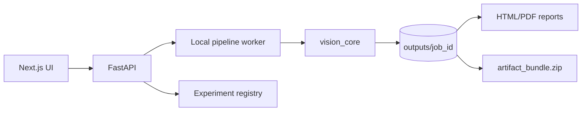

# Architecture

SceneMotion-3D is split into a frontend, backend, local worker, and `vision_core` package. The backend owns job lifecycle, input validation, artifacts, and API responses. The worker calls the geometry pipeline. The frontend reads real API state and artifacts.

The design is production-style but intentionally local-first. Redis and Docker Compose are included, but the default demo remains offline-safe and lightweight.
