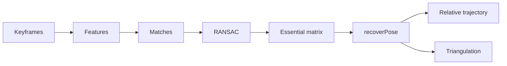

# Visual Odometry Pipeline

The visual odometry path estimates relative motion from a monocular video.

1. Select keyframes.
2. Extract features using ORB by default.
3. Match neighboring keyframes.
4. Use RANSAC to remove outliers.
5. Estimate the essential matrix.
6. Recover relative rotation and translation direction.
7. Chain poses into a relative trajectory.
8. Triangulate sparse points and compute reprojection error.

The translation scale is not metric unless an external scale source is provided.
