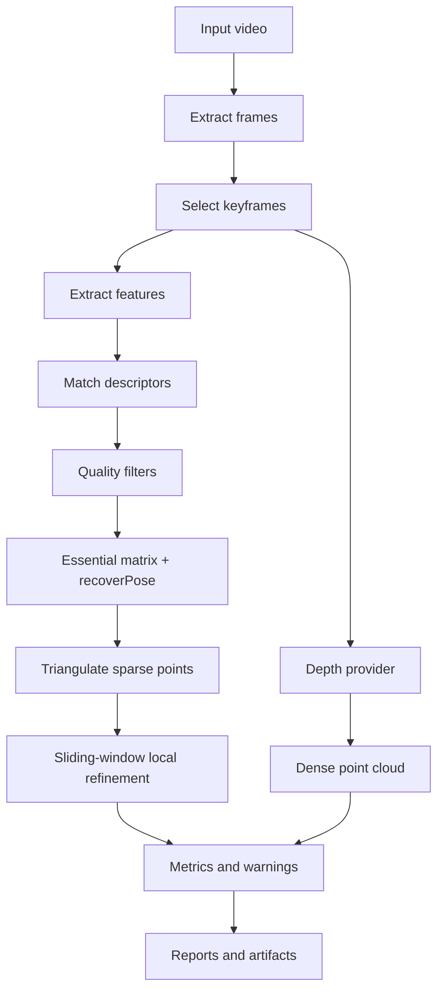

# Workflow

```mermaid
flowchart TD
    Video[Input video] --> Frames[Extract frames]
    Frames --> Keyframes[Select keyframes]
    Keyframes --> Features[Extract features]
    Features --> Matches[Match descriptors]
    Matches --> Filters[Quality filters]
    Filters --> Pose[Essential matrix + recoverPose]
    Pose --> Sparse[Triangulate sparse points]
    Sparse --> BA[Sliding-window local refinement]
    Keyframes --> Depth[Depth provider]
    Depth --> Dense[Dense point cloud]
    BA --> Metrics[Metrics and warnings]
    Dense --> Metrics
    Metrics --> Report[Reports and artifacts]
```

Every stage writes artifacts so reviewers can inspect how the final result was produced.
